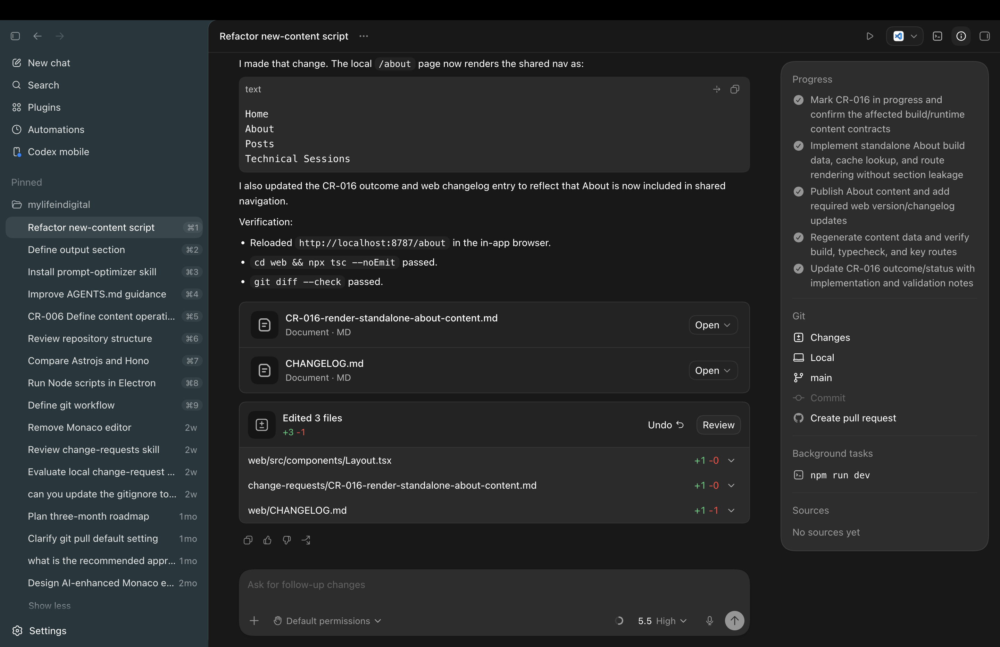

# Content Editor UI/UX design

For reference see [CR-006: Define Content Operations App Scope and Workflows](../../change-requests/CR-006-define-content-operations-app-scope-and-workflows.md)

The current Codex app can serve as a source of inspiration for the design of the MyLifeInDigital editor app. We are working towards building a content editor. The content editor will let me create content using templates. 

I took a screenshot of the design to serve as inspiration.

On the left-hand side there should a "New..." in the same way as there would be a "New chat". When clicking new it should provide a mechanism to select a template. We provide two templates at the moment:

1. About
2. Post

The center container would be an editor where a user can create the content. The left container can be an "AI editing assistant" reference panel. In the editing assistant panel we can show the suggested edits. Suggested edits can be created when I am typing something in the content panel and ask for assistance clarifying a concept or helping with ambiguity. I am wondering if using skills would be worthwhile addition at some point. 

But apart from that would a manifest help with the structure? Like when I create a new post or technical session can a manifest help? The manifest contains a reference to the content item and then a list of editing suggestions. The manifest is almost like a snapshot of the main content item and a list of references editing suggestions. The references should reference actual line numbers in the document.  
